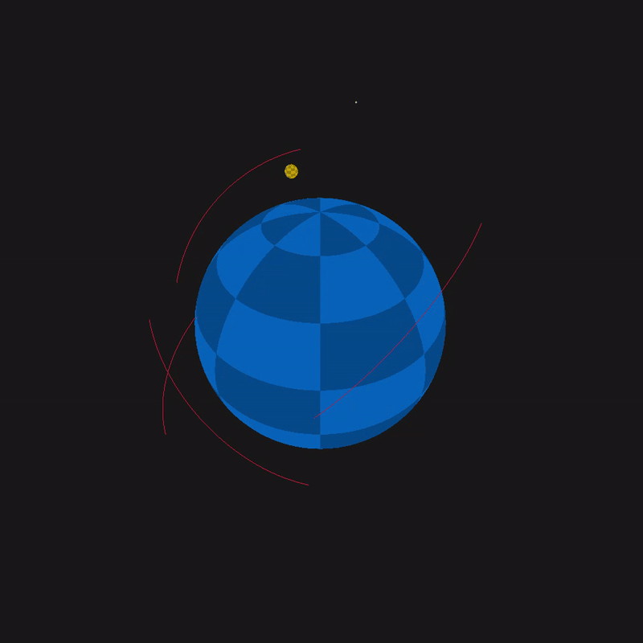
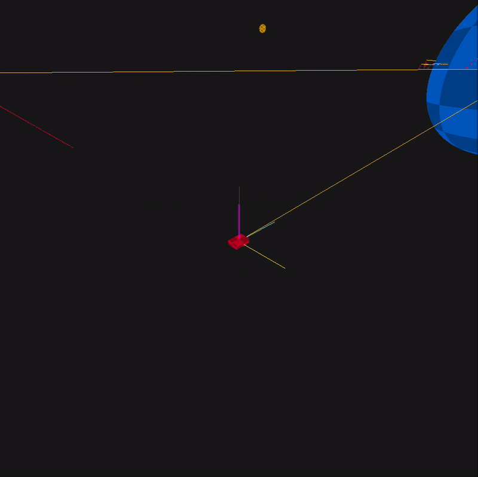

# astrolib-odin

## Library for orbital mechanics and attitude dynamics for spacecraft

## Example

## Controls (subject to change)
- Start Simulation: space
- Reset Simulation: shift+r
- Toggle Attitude Dynamics: i
- Camera Switching (satellite target, body target, origin): c
- Cycle Camera Target: n/shift+n
- Camera Lock: shift+c
- Cycle Target: n/shift+n
- Zoom into target: Mousewheel up/down
- Camera Azimuth/Elevation: w/a/s/d
- Reset Time Scale/Substeps: r
- Increment Substeps (physics iterations per frame): up/down
- Increment Time Scale (delta time scaling): left/right
- Toggle Trails: t
- Adjust trail length: [ or ]
- Toggle Wireframes: tbd
- Toggle Axes: o
- Toggle Position Vectors: p
- Spawn Satellite: . (period)
- Print FPS to Console: f
- Print Simulation Delta Time to Console: g

## How to Build

1. Install [Odin-lang](https://odin-lang.org/docs/install/)
2. Copy myrlgl.odin into `<path_to_odin>/vendor/raylib/rlgl`
3. Create a `build` directory in the project root
4. Build and run with
   1. Mac/Linux: `<path_to_odin_binary> run . -out:build/out -o:speed`
   2. Windows: `<path_to_odin_binary> run . -out:build/out.exe -o:speed`
